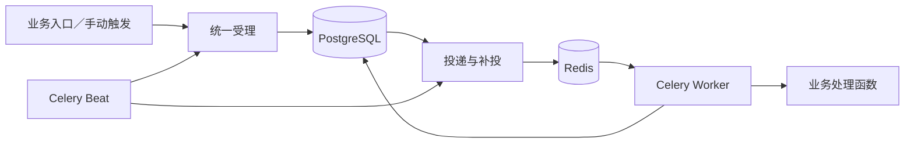

# 公共任务组件、可靠受理与业务恢复

2026-09-11，老板确认将现有定时任务重构为各业务领域共用的任务组件，采用 Celery Beat、Celery Worker 和 Redis，PostgreSQL 保存受理与恢复依据。2026-09-13 已完成公共组件、业务入口、任务管理及部署配套，开发库按授权升级并核对用户数据保持一致。真实 PostgreSQL 隔离迁移、并发、事务交接、三存储故障恢复、Windows 原生业务与页面联调、Linux prefork 队列验收均已通过；GitHub Actions 已完成运行服务切换和前端发布。精确实现及验证入口见代码和各模块 README；本文末尾保留重构前的历史决策。

## 已确认的重构方向（2026-09-11 确认，2026-09-13 实施完成）

老板确认把定时任务抽为项目内部公共组件，供知识库、Agent 及未来业务领域按统一契约接入，新增任务类型不要求修改公共核心。技术路线采用 Celery Beat、Celery Worker 和 Redis：Beat 负责周期触发，Worker 负责后台执行，Redis 作为 Celery 的消息代理；PostgreSQL 继续保存任务配置、任务执行记录及恢复依据。

当前以少量后台任务为主，选择 Redis 是为了使用 Celery 已支持的接入方式并控制运维成本。此阶段不同时引入 RabbitMQ 或 RocketMQ，也不保留 APScheduler 作为另一套调度来源。RocketMQ 的取舍在于它与 Celery 缺少官方现成接入，并非 Python 不能使用 RocketMQ。

该方向替代 ADR 0014、ADR 0017 及本文中 APScheduler 调度、不引入任务队列和手动触发由 API worker 执行的约定。本节是本次实施依据，下文旧规则用于说明迁移来源，不能覆盖已确认的新需求。

已确认的需求：

- 公共组件同时支持周期触发和业务直接提交的一次性后台执行，共用任务类型注册、任务执行记录和状态查询；一次性执行不要求先创建定时任务。
- 本次将现有三类定时任务及其手动触发、文档解析与采用的后台处理、手动 Pipeline 统一迁入 Worker，复用所属业务现有处理逻辑和持久待办。文档解析、审核、采用状态仍由知识库业务管理；手动 Pipeline 改为提交一次性任务执行后返回编号，再查询状态和结果。
- 错过的周期不补执行，等待下一个正常执行时间或人工触发一次，保留原有的不补执行规则。
- 已持久受理、尚未开始的任务执行在服务重启后保留并继续处理；不补错过的周期不等于丢弃已受理执行。开始执行后的故障恢复仍须区分可安全重试与远端写入结果不确定的情况。
- 同一条定时任务最多保留一条待执行或执行中的任务执行，期间新的周期触发跳过；等待自动重试仍属于当前这次尚未结束的执行，沿用这一重叠规则。不同定时任务之间的业务资源协调仍需由所属业务明确。
- 由任务类型声明可安全重试的错误，默认在初次尝试之外最多自动重试三次，重试间隔逐渐增加；次数耗尽后记录失败，允许人工重试。这调整了原有的业务失败不立即重试规则；远端写入结果不确定时仍沿用人工核实边界。
- 本次任务执行重试耗尽后，下一个正常周期仍按计划发起新的一次任务执行，重试次数重新计算；一次执行失败不自动停用定时任务。
- 允许在任务启用或执行期间修改 cron 和业务参数，新配置只用于之后受理的任务执行；已受理执行及其自动重试继续使用提交时的配置快照。这替代了原有的修改前必须停用并等待当前执行结束的限制。
- 停用定时任务只阻止后续周期触发，已受理的任务执行继续处理，包括允许的自动重试；停用周期配置与取消某次任务执行是不同操作。
- 删除周期配置只移除该配置并阻止后续周期触发；已受理执行沿用前述受理和取消规则，执行历史独立按保留策略处理，不随配置级联删除。
- 人工重试使用失败时的参数快照，新建一次任务执行并关联原失败记录，保留原执行历史；需要使用最新配置时，通过当前定时任务的手动触发入口发起。
- 同一次提交因网络超时等原因被重复发送时，返回原任务执行编号，不重复创建任务执行；不同业务操作不因参数相同而自动合并。
- 取消操作只支持尚未开始或等待自动重试的任务执行；本次不提供执行中任务的取消操作。
- 不同任务执行因业务资源被占用而暂时无法推进时，保留执行并等待资源释放后继续，页面展示等待原因；这种等待不算业务失败，不消耗自动重试次数。
- 批量任务复用业务已有的持久待办与完成标记，不新增通用批次续执行或进度系统。已完整提交的清理目标不再选中，未完成步骤按业务依据继续；PostgreSQL、Qdrant 和原件存储之间没有共同事务，不能把中断解释为当前批次全部回滚。
- 日常操作使用“立即执行／重试”，后台先检查已有执行和业务依据，能够明确安全继续的自动处理，无法确认旧执行者或远端写入已停止时才提示核实；本次不新增独立人工恢复页面，不把心跳过期视为可安全重做的依据。
- 配置界面提供常用周期选择，同时保留直接编写 cron 的入口，覆盖常用选项无法表达的特殊周期。
- 沿用现有五段式 cron 及其解释规则，周期配置最小到分钟，使用统一的调度时区，默认 `Asia/Shanghai`；页面明确标注时区并预览未来执行时间。调度时区只用于解释周期和展示，计划、受理、开始、结束等具体时刻仍以 UTC 持久保存，保持 `DATABASE_TIMEZONE=UTC`，不改变数据库时区约定。
- 普通已结束任务执行记录默认按结束时间保留三十天，保留天数可配置，替代原有的每条定时任务只留最近五十条的策略；未结束、待人工核实或仍承担恢复依据的记录不按普通历史过期规则清理。文档等业务数据继续按所属业务规则管理。
- 默认重试次数、重试间隔和历史保留天数提供管理配置，哪些错误可安全重试仍由任务类型代码声明；Redis 连接和 Worker 数量等基础设施参数放在部署配置中。每次受理保存当时生效的执行策略，策略修改只影响之后受理的执行，已受理执行及其自动重试继续使用原有快照。
- 原“定时任务”管理入口改为“任务管理”，分别展示周期配置和任务执行，一次性后台执行也纳入查询。全局管理沿用超级用户权限，各业务页面按原有业务权限展示相关任务状态。

老板说明当前仍在开发阶段，所有任务已停止；这是本次迁移的开发背景，不改变上述重构后对已受理执行的恢复要求。

上述二十项问答已经收敛。批次间是否释放业务资源属于另一个等待时长优化，本次沿用现有业务工作单元的互斥范围。

## 组件边界与部署形态

公共任务组件负责类型注册、参数校验、受理、周期计算、投递、执行状态和查询。业务领域提供参数模型、处理函数、可安全重试的错误分类，以及需要时的恢复判断；资源名称、占用规则、Document 状态和跨存储处理仍归知识库业务。装配入口将业务注册项交给公共组件，公共核心不反向导入 `knowledge/` 或 `agent/`，也不从数据库加载代码。新增任务类型只增加业务实现及注册，按需要补前端表单和结果适配。

API 只校验权限、持久受理并返回执行编号；耗时业务工作由 Worker 执行。部署使用同一后端镜像的 API、单个 Beat 和 Worker 服务，Worker 可按容量增加进程或实例。首期使用一个业务队列，保留 Celery 的路由扩展入口，不按每个任务类型建立队列。

2026-09-13，老板明确 Redis 是项目共用中间件，可供任务队列、缓存等用途使用，替代原先的任务专用 Redis 约定。连接配置统一归 `REDIS_*`，任务队列仅保留自己的执行参数，并按队列名隔离消息与辅助键；其他使用方管理各自的键前缀。部署可连接已有 Redis，也可使用编排自带实例，本次只接入任务用途，不预建缓存框架。

本次迁移 `freshrss_sync`、`index_pending`、`prune_old_documents` 及其手动触发、文档后台处理和 HTTP 手动 Pipeline。文档后台处理复用已有有界处理批次，仍由业务待办驱动，不要求用户配置 cron，也不让原常驻消费者长期占用一个 Worker 执行位置。业务待办与触发它的受理依据在同一 PostgreSQL 事务中保存，后续仅补投同一次执行；正常批次完成后仍有待办时，在同一短事务中记录本批完成并受理必要的下一批，防止两步之间退出使剩余待办无人处理，不建立公共批次进度模型。任务执行失败、取消和待核实的路径不自动续建下一批，取消或重试耗尽的执行不能被补投循环当成新任务无限重建；单篇文档的解析异常仍按知识库规则留待处理，不因此阻断其他正常资料。现有 CLI 维护入口继续参与同一业务写资源协调；本次不扩大为迁移所有 CLI 或 Agent 对话。

前端“任务管理”分别展示周期配置和全部任务执行，详情按执行编号独立查询，不能依赖周期配置仍然存在。公共列表负责状态、触发来源、时间、次数和等待原因；业务表单、统计含义和业务详情链接通过显式适配接入。未知类型或未适配的结果要如实展示类型和可识别信息，不能显示为“本轮无变更”。HTTP 手动 Pipeline 的受理响应、结果查询及调用页面一并调整，权限仍在原业务入口校验，不借公共提交接口扩大权限。

## 调度、受理与消息投递

Beat 使用项目自己的 PostgreSQL 调度适配器，读取现有周期配置、配置版本和下次计划时刻。Celery 默认 Beat 不会自动读取本项目任务表，`django-celery-beat` 也不能直接套在 FastAPI 上；不另存一份静态 `beat_schedule` 作为业务配置。到点后以短事务复核配置版本、启用状态和当前执行，原子地受理或记录重叠跳过，并推进下次计划。以周期配置的稳定编号和计划 UTC 时刻识别同一个周期事件，数据库约束防止重复受理；不把配置版本变化当成同一时刻再触发一次的理由。

启动、恢复和修改配置时，错过的计划点直接移到未来，不枚举停机期间的周期；正常投递误差沿用现有边界，不扩大为补跑窗口。配置修改、删除与受理在数据库中协调先后顺序，旧版本的调度回调不能受理新执行。已经受理的执行与周期推进独立：即使 Redis 或 Worker 暂时不可用，恢复后也继续处理这条已有记录。

调度、校验和预览共用同一个 cron 计算入口。本次将现有 `CronTrigger` 的表达式计算从 `ScheduledJobRunner` 中抽出，保留五段式语法、星期编号和组合规则；它仅作为兼容现有 cron 的计算依赖，不启动 APScheduler 调度器，也不再保留进程内调度模式。Celery 本身不要求 APScheduler，保留这部分计算是为了兑现已确认的 cron 兼容要求，避免直接换用 Celery `crontab` 后静默改变日期含义。

统一受理在一个 PostgreSQL 事务中保存任务执行、原始请求的去重回执和投递待办。执行记录自身承载投递状态和下次可投递时刻，不另建通用消息平台。提交时冻结校验后的参数、类型与必要版本信息、来源配置、操作人及执行策略；消息只携带执行编号和投递代次，Worker 从数据库取得可信快照。连接凭据不放入消息或任务参数快照，继续由部署及业务连接配置管理。

数据库提交成功后才返回“已受理”，随后尝试投递 Redis。Beat 的维护循环扫描已到时间但尚未被领取的记录，补齐提交后进程退出、发布失败或 Redis 丢失消息留下的缺口；发布成功不代表业务已开始，不能因此永久停止核对。投递采用有间隔的补试，数据库短事务只领取投递资格，网络发布不持有长事务。PostgreSQL 提交失败时不返回受理成功；提交结果不明时调用方用原请求标识重查或重发。

Worker 必须在数据库中原子领取执行，核验状态、投递代次和可开始时间。重复、迟到、已取消或已结束的消息不再次调用业务函数；执行结果也按领取代次条件写回，防止旧执行者覆盖新状态。保证的是持久受理、可补投和受控领取，不承诺远端操作“恰好一次”；跨存储部分成功仍依靠业务的重复执行安全与结果核验。

同一周期配置的并发限制覆盖排队、资源等待、执行中和等待自动重试；不同的手动请求遇到已有执行时返回冲突及当前执行编号，同一次请求重发则返回其原编号。删除周期配置后，已受理执行仍保留原配置身份和快照，其领取、恢复与查询不能依赖被删除的配置行。

## 执行、等待与故障恢复

业务自动重试继续沿用同一个执行编号，次数和下次尝试时间由 PostgreSQL 记录；按受理时的策略逐渐增加间隔，默认初次尝试之外最多三次。Beat 在到期后投递，不把长时间的 `ETA/countdown` 任务常驻 Redis，也不同时启用另一套 Celery `autoretry` 计数。人工重试是新受理：沿用原失败参数，关联原执行，采用新受理时生效的执行策略；“立即执行”使用当前周期配置。可重试错误分类还须结合业务当前状态，不能仅凭异常名称重新发出结果不确定的写入。

资源暂时被正常执行占用时，将原因及再次检查时间持久保存后让出 Worker 执行位置；资源可用后继续同一次执行，不消耗自动重试次数。尚未开始的资源等待也允许取消；已开始业务工作后不提供执行中取消。取消与 Worker 开始业务工作通过同一状态条件竞争，只有一方成功；取消成功后，队列中的旧消息不能启动业务。正常失败释放资源，记录为失败后不影响下一周期的独立执行和重试额度。

对崩溃后的旧执行，先区分从未开始、可安全继续和结果不确定。从未开始的直接补投；已开始的只有在所属业务能根据持久标记、执行者状态及远端核验确认安全时才自动继续，自动再次尝试也受原重试额度约束。证据不足时保留“待核实”和占用，在任务详情说明阻塞原因及核实步骤，沿用维护入口处理，不新增独立恢复页面。心跳消失、Redis 消息重新出现或 Celery 报 Worker 丢失，都不能单独证明旧远端写入已停止。

清理复用 `document_deletions` 和逐项确认：已删除并完成数据库收尾的 Document 不再选中，剩余目标继续核对 Qdrant、原件和数据库步骤。远端成功而本地确认未提交时，可能再次请求删除同一目标；这与重新处理已完整完成的数据不同。资源仍按现有同步、索引及清理的业务范围协调，不因迁入 Worker 自动缩小到批次或仅靠 Redis 锁保护。

Celery 使用完成后确认消息的方式（`acks_late`），配合较小的预取量；子进程异常退出时的消息处理必须与数据库恢复配合，不能把 `task_reject_on_worker_lost` 当作无条件重做业务的开关。Redis 的默认可见性超时是一小时，超时会重新投递未确认消息。现有清理没有整次时长上限，因此不能靠把这个值调得很大来保证安全；重复投递由数据库领取挡住，丢失的待执行消息由持久记录补投，已开始的执行走上述恢复判断。停止 Worker 时先停止领取并等待当前工作，强制退出后的恢复必须验收。

生产 Worker 使用 Linux 的 prefork 方式。本项目大量业务函数使用 asyncio，每个 Worker 子进程在 fork 后建立自己的持久事件循环、数据库 Engine 和客户端，依赖惰性初始化，并在同一循环内使用和关闭；API、Beat 和 Worker 不继承或复用彼此的异步连接池，也不跨多次 `asyncio.run()` 复用旧连接。业务 Runtime 继续按执行创建，数据库事务保持短小。Windows 原生可开发页面、API，并运行 Beat 和单进程 solo Worker；真实受理、补投、资源等待、业务执行及正常关停已验证。生产 prefork 的并发与进程故障使用 Linux 验收，可在远端主机、Docker 或 WSL 中运行，本次由 GitHub Actions 的 Linux runner 完成。

共享 Redis 启用 AOF、持久数据盘和实例级 `noeviction`，避免内存淘汰任务消息。缓存按 TTL 过期；内存满时新增写入会失败，这是共用实例的容量取舍。任务可见性超时、重连和内存告警继续配置；这些减少消息丢失风险，不替代 PostgreSQL 的受理依据。执行状态、结果摘要和历史只保存在 PostgreSQL，本次不启用 Celery result backend。运维至少能区分 Beat 停止推进、投递失败、Worker 不领取、正常资源等待和待核实，避免只看 Redis 队列长度判断系统正常。

## 时间、策略与历史保留

调度时区用于把 cron 换算成具体时刻，所有持久时间仍是带时区的 UTC，保持 `DATABASE_TIMEZONE=UTC`。例如每天北京时间 09:00 对应当天 UTC 01:00，北京时间 00:30 对应前一天 UTC 16:30。API 用带时区时间传输，页面明确标注调度时区；不能通过更改数据库连接时区或保存无时区的北京时间实现展示。未来执行预览与 Beat 使用相同计算入口。

重试策略及历史保留天数提供超级用户管理入口，修改有留痕；当前周期、参数和任务执行仍在任务自己的表中，不复制成全局字典，保持全局业务配置与业务专属配置的职责划分。每次执行保存当时策略；普通历史从结束时间起按该快照计算保留期限，之后调整默认天数不追溯改变已受理执行。恢复依据与未结束执行受保护，普通历史清理不能带走业务删除待办。

请求去重按提交方、业务操作和请求标识区分，保存原请求摘要；相同标识换了请求内容时返回冲突，不能创建第二条执行，也不能仅凭参数相同合并不同操作。三十天清理普通历史时，最小去重回执继续保留原执行编号和请求摘要，不保留参数或结果正文；旧请求重发仍返回原编号并说明详情已过保留期，不静默创建新执行。这意味着当前契约下小型回执持续占用存储；若以后要限制去重时长，应先明确过期请求的处理契约，不能顺手与历史一起清除。

人工重试关联的原失败记录，在关联执行仍保留期间受到保护，保证能沿关联查看失败参数及原因；超期清理不能留下无法解释的悬空关联。已过保留期且参数快照已清理的普通历史不再提供重试按钮，需要基于当前配置重新提交。删除配置不级联删除执行及去重回执，历史读取独立校验原有权限。

## 迁移与验收

实施顺序为公共契约和持久受理、Beat／Redis／Worker 接入、现有业务入口迁移、任务管理界面及部署文档联动。迁移执行历史与配置关联，补齐受理快照和必要状态；不能直接删除现有业务待办或依赖旧快照猜测执行结果。即使开发阶段当前没有活动任务，也应验证迁移前提，再停用旧 APScheduler 和消费者，避免新旧执行入口同时处理同一业务。本次开发库升级和服务切换已按老板授权执行；后续环境仍须按各自授权和迁移前提操作。

验收以可观察结果为准，实施时至少覆盖：

- 多种历史 cron 的星期、月份和组合语义保持一致，北京时间与 UTC 的同日及跨日转换正确，预览与真实计划相同；停机漏过多个周期不补跑。
- 同一请求重发和重复消息只产生一次受理与有效领取；不同请求不因参数相同合并，使用同一标识修改请求内容明确报冲突。
- PostgreSQL 已提交后发布 Redis 失败，或消息发布后丢失，恢复后能继续原执行；未完成数据库提交的请求不能显示已受理。
- 文档后台处理在批次交接时退出，本批完成与下一批受理一并提交或一并回滚，剩余待办不会失去执行入口；失败、取消和待核实路径不续建批次。
- Worker 在领取前、业务执行中、远端成功但本地未确认时被强制终止，分别验证补投、安全恢复或待核实；仅心跳过期不能发生并发旧写入。
- 配置修改、停用和删除与周期受理并发时，按事务先后使用正确快照；已受理执行继续，删除后仍能按编号查询历史和结果。
- 同一配置在排队、资源等待和自动重试期间的新周期被跳过；不同任务争用资源时等待可见、让出执行位置，资源释放后继续。
- 取消与 Worker 开始竞争时，取消成功的执行不会调用业务；已经开始则拒绝执行中取消，旧消息不能恢复已取消执行。
- 自动重试次数耗尽后记录失败，下一正常周期独立执行；人工重试使用旧参数、新受理策略和关联记录，自动重试始终使用原策略。
- 清理跨存储部分成功后只继续未完成工作，完成标记不丢失，旧索引与正式正文等业务可见性契约保持有效。
- 历史到期、保护中的失败关联、配置删除及去重回执共同工作；旧请求在详情清理后不创建新任务，清理不删除业务恢复依据。
- 多个 prefork 子进程连续处理异步任务、重连和关闭时没有跨进程或跨事件循环复用连接；Worker 退出、Redis 持久化重启及长任务重复投递按上述规则处理。
- 三类定时任务、文档后台处理和 HTTP 手动 Pipeline 的端到端入口均在 Worker 完成；任务管理能显示一次性执行、等待原因、失败与重试结果，业务权限不被扩大。

上述实施验收已完成。开发库升级至 `b6e2f9047a31`，保留账号、凭据、Agent 会话、审核记录及任务身份；真实 PostgreSQL／Qdrant／S3 验证跨存储恢复，Linux Redis／Beat／prefork Worker 验证重投、重连、强制中断及正常关停，运行环境已停用旧 scheduler 并完成新进程就绪检查。Windows 页面联调使用真实 HTTP、认证、数据库与队列；非空业务组合保留真实处理算法、应用与事务，外部来源、原件、Embedding 和向量端口使用替身，不将其宣称为全部业务上游的真实端到端验收。

## 设计消融

去掉独立通用批次进度系统后，已有业务待办和完成标记仍能支撑清理、解析与采用，因此复用它们。去掉独立恢复页面后，日常“立即执行／重试”和任务详情中的异常说明仍覆盖已确认操作，异常核实复用现有维护入口。去掉 Celery result backend 后，PostgreSQL 已经覆盖查询、结果和恢复，所以不保存第二份任务状态。

保留自定义 Beat 适配、持久补投和数据库领取，是因为默认 Beat 不读取业务表、数据库提交与消息发布之间存在故障间隙、消息也可能重复；它们各自保护已确认的需求，不能只靠 Celery 默认配置替代。扩展采用普通注册和装配，不增加动态插件加载或通用表单引擎；本次没有需要这些设计解决的接入场景。

技术依据：[Celery 周期调度](https://docs.celeryq.dev/en/stable/userguide/periodic-tasks.html)、[Redis 消息代理及可见性超时](https://docs.celeryq.dev/en/stable/getting-started/backends-and-brokers/redis.html)、[任务确认与重新投递](https://docs.celeryq.dev/en/stable/userguide/tasks.html)、[Worker 并发方式](https://docs.celeryq.dev/en/stable/userguide/concurrency/index.html)。

## 重构前的实现决策

2026-09-05，沿用 [ADR 0017](0017-scheduler-runs-in-a-dedicated-process.md) 的生产独立 scheduler 和多 worker API。原来的进程内锁无法覆盖手动触发与不同进程，清理又与同步、索引共享 Document 和 Qdrant，因此在已有 PostgreSQL 中统一认领任务执行，并协调新闻写资源。

当时的决策替代 ADR 0014、0017 中的“10 分钟宽限补跑”、仅靠进程内互斥以及“中断后只靠索引超时回收即可恢复”的表述，保留内存 job store、数据库事实来源、同任务重叠跳过、业务失败不立即重试和历史保留策略，并解决 ADR 0017 记录的装配复制债。以下为重构前的历史，与上文冲突的部分不再作为新实现规范。

- 配置、修改、删除和任务执行认领通过同一任务行的短事务协调。修改 cron 或参数前必须已经停用并结束当前任务执行，保存后保持停用；启用是单独操作。停用不取消已受理执行，仍允许手动触发。
- API 接受的手动执行归当前 worker，cron 归 scheduler，两者共用执行组件。scheduler 周期刷新配置，认领时复核启用状态及配置版本，不依赖 API 的内存通知。
- 同步和索引分别串行，两者可并行；清理取得两种写资源并排他执行。持久占用覆盖整个业务工作单元，数据库咨询锁仅用于短事务检查与更新，等待或网络调用时不持有它。
- 心跳用于诊断，不作为自动抢占凭据。进程中断、远端写入超时等不能证明旧写入已经停止，保留占用；操作者确认所属进程和远端未决写入均已停止后才释放，不自动重做业务。
- 清理只选择超过保留期且已完成索引的 Document，连续分批处理，不设整次数量、批数或时长上限。默认预演；真实删除先保存独立删除待办，再删除 Qdrant，最后条件删除 PostgreSQL。待办不随任务历史裁剪或配置删除消失。
- 清理范围（2026-09-06 修订）：清理只作用于任务参数列出的 KnowledgeBase，未完成删除待办的恢复使用同一范围；参数缺省时为兼容旧配置只解析到新闻知识库，绝不解释为全库清理。不同保留周期通过多个任务实例表达，列表中的库共用同一周期。
- 错过 cron 不补执行，启动和刷新只排未来时间。APScheduler 保留一秒正常投递误差，超出即跳过；业务候选留待下一次正常执行或手动触发。
- 任务注册项直接关联参数模型与执行函数，使用普通函数和共享按需 Runtime 装配，不引入任务队列、动态插件、通用基类或表单引擎。

## 重构前的代价与边界

清理慢会让同步和索引等待；无法证明旧写入停止时也会阻塞后续写操作。这是老板接受的数据安全取舍，不能改成心跳过期自动解锁。PostgreSQL 和 Qdrant 不具有共同事务，日志、删除待办和条件重验用于识别与继续未完成工作，不承诺回滚已删除数据。

升级涉及新增持久化状态，新旧写入口不得无保护混跑。就绪检查复用配置刷新状态并只读本地文件，不周期探测全部远程依赖。离线测试只证明规则与收尾分支；多进程事务和跨库恢复需通过已授权的开发服务集成验证。验证复用现有 PostgreSQL/Qdrant，只创建并清理随机 schema、Collection/Alias 和合成数据，不要求另建测试服务器；生产切换与容器就绪仍在发布时单独验收。
