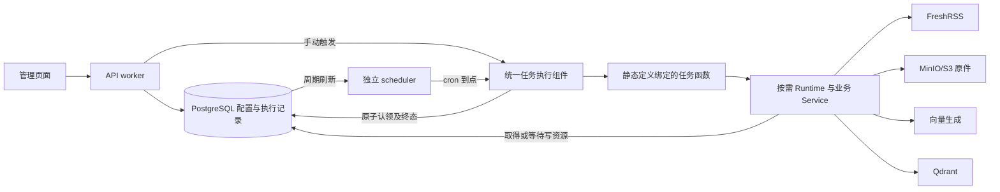

# 定时任务配置到任务执行

本链路跨前端、API worker、独立 scheduler、PostgreSQL 与业务写入口。决策见 [ADR 0019](../adr/0019-scheduled-execution-and-write-coordination.md)，精确接口和持久化字段见后端架构、schema 与代码。

图中的执行组件是共享代码，实际位于受理本次执行的进程中；手动执行不会转交给 scheduler。不同任务按需要创建依赖。

独立 scheduler 还消费文档处理待办，不需要创建新的 cron 任务。接收成功后即可由它推进解析、预览和采用；API 进程不启动该消费者。文件与来源更新的待办、预览和正式版本切换见 [文档生命周期](file-document-lifecycle.md)。

## 配置与受理

1. 页面从后端取得任务类型及参数元数据。API 校验并保存配置，scheduler 通过数据库刷新获知变更。
2. cron 使用注册时的配置版本发起认领，数据库再次核实任务存在、启用且版本一致；旧回调不能用旧时刻执行新配置。
3. 手动和 cron 共用认领规则，配置快照与开始记录保存成功后才能执行业务。同任务冲突时，手动明确拒绝，cron 留下结束的跳过记录。
4. 修改配置须先停用并等待当前执行结束。停用不取消已受理执行；配置删除不得丢弃活动执行或未确认的写占用。

## 业务与收尾

任务函数通过公开 Runtime 入口取得所需写资源。同步和索引彼此可以并行，同类操作串行；清理取得两种资源后排他执行。HTTP Pipeline 和 CLI 使用相同规则，清理慢会使其他写入等待。

业务结束后处理写占用，关闭本次客户端，再保存任务执行终态。成功计数、子项失败、资源关闭错误和终态保存失败分别表达；终态保存重试不会重新执行业务。进程关闭先停止受理，等待或取消业务并完成收尾，最后释放进程依赖。

页面通过回执中的任务执行 ID 查询结果，不依赖最近历史页是否包含它。关闭面板或离开页面不取消后台执行；当前标签页保留回执，重新进入继续查询。请求超时表示受理情况待核实，不自动重发。

## 清理失败边界

预演遍历候选并统计，不写业务删除待办或业务数据。待审核、失败、拒绝及存在未采用候选的资料不自动清理。真实清理先持久化目标及全部清理依据并停止使用，再清除相关 Qdrant 实例与 MinIO/S3 原件，全部确认后删除 PostgreSQL 正文、候选、历史和审核记录并完成待办。跨存储步骤不共享事务，已经提交的批次不会因为后续失败而回滚。

待办阻止同步和索引重新写入目标；后续正常清理优先处理待办并再次核实资格。本次失败目标会留下原因，具备继续条件时处理后续批次，远端写入结果不明则停止并保留占用。

## 中断与排查

错过 cron 不补执行，下一次处理业务候选与补发旧 cron 是两件事。强制退出可能来不及保存终态，心跳失联只表示待核实。先确认所属进程和远端未决写入已停止，再人工修复记录和占用；修复动作本身不删除 Document、不重做同步或索引。

下次计划时刻仅是配置计算结果。部署另查 scheduler 本地就绪状态，确认配置加载与刷新仍在进行；不会通过真实业务执行来探测健康。操作步骤见 [部署与恢复](../container_deployment.md#定时任务升级与恢复)。
