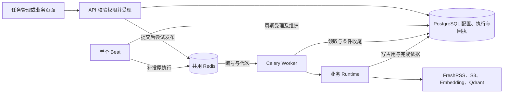

# 周期与一次性任务的持久受理和执行

本链路跨前端、API、Celery Beat、Redis、Worker、PostgreSQL 与业务写入口。决策见 [ADR 0019](../adr/0019-scheduled-execution-and-write-coordination.md)，精确状态和字段见后端 schema、模型与代码。

API 返回受理回执后，耗时工作由 Worker 完成。文档批次、HTTP Pipeline 和周期类型共用公共组件；业务自己管理资源及恢复依据。文档待办不需要用户配置 cron，接收与批次交接见 [文档生命周期](file-document-lifecycle.md)。

## 配置、受理与投递

1. 页面取得任务类型元数据，保存周期配置或提交一次性工作。Beat 从 PostgreSQL 读取动态周期；预览和调度使用同一 cron 计算及调度时区，具体时间以 UTC 持久保存。
2. 到点时，受理与配置修改、停用、删除通过同一配置行锁协调。复核启用状态、版本和计划时刻后，原子保存执行或重叠跳过，并推进未来计划。启动和恢复不补停机期间的周期。
3. 手动提交在一个事务中保存执行快照、原请求回执和投递依据，成功后返回执行编号。同一个请求重发返回原编号，标识相同而内容不同明确冲突；不同操作不因参数相同合并。
4. 启用或执行期间可以编辑、停用和删除配置。已有执行及自动重试保留原快照，删除配置后来源身份和执行历史仍在。同配置尚未结束时，新周期跳过，新的人工触发返回冲突与当前编号。
5. Redis 发布不持有数据库长事务。发布失败、提交后退出或消息丢失时，Beat 补投原执行；发布成功也不代表业务开始。Worker 按状态、代次和可开始时间领取，重复、迟到和取消后的消息不再启动业务。

## 业务、等待与收尾

任务准备业务资源后才竞争“开始”状态。正常资源占用使执行保存等待原因并让出 Worker 位置，不消耗自动重试次数；资源释放后继续原执行。取消与开始由同一数据库条件竞争，取消成功的旧消息不能启动业务；已经开始的业务尝试不提供取消。

同步与索引仍按原业务范围协调，清理排他取得两种写资源。HTTP Pipeline 的同步阶段只占同步资源，处理阶段沿用采用与回收的资源边界；CLI 也参加同一协调。不能因迁入 Worker 缩小整次清理的占用范围。

可安全重试的业务失败沿原执行编号、参数和策略等待下一次尝试，次数耗尽后记录失败；下一正常周期独立计算额度。人工重试创建关联的新执行，使用原失败参数与当前策略；立即执行使用当前周期配置。部分失败、资源关闭错误和终态保存失败分别表达，重试终态保存不会重新调用业务。

## 页面与历史

任务管理分周期配置和全部任务执行。详情按编号查询，不依赖配置仍存在或最近列表包含目标；地址与当前标签页保存查询位置。提交前保存原请求身份及参数，超时后显式确认原请求，不能换标识盲目重发。关闭面板或离页不取消后台执行。

默认策略修改仅影响之后受理的执行，并保留修改记录。普通终态详情到期后清理，未结束、待核实和仍被人工重试引用的原失败受到保护；业务删除待办独立保留。最小请求回执继续保留，旧请求返回原编号并说明详情过期，不能重新创建工作。

## 跨存储失败与进程恢复

清理先保存目标、原件引用和删除依据并停止使用，再确认 Qdrant、S3 和 PostgreSQL 收尾。完整完成的目标不再选中；远端删除已成功但本地确认未提交时，可以重复核对同一目标。各存储没有共同事务，后续失败不会回滚已提交成果，普通历史清理或配置删除也不能带走业务待办。

从未开始的失联执行可撤销准备后补投；开始后的执行只有业务证据足以确认完成或安全继续时才恢复。结果不确定时保留待核实和写占用，心跳过期、Redis 重投或 Worker 丢失都不能单独证明旧远端写入已停止。维护人员核实后通过已有维护入口处理，页面不另建恢复系统。

Worker 正常退出先停止领取并等待当前工作；强制退出后走持久恢复判断。Beat 的本地就绪表示周期仍在推进，Worker ping 表示消息连接可达，都不等于业务已成功。排查分别查看 Beat、投递错误、领取、资源等待和待核实原因，步骤见 [部署与恢复](../container_deployment.md#定时任务升级与恢复)。
